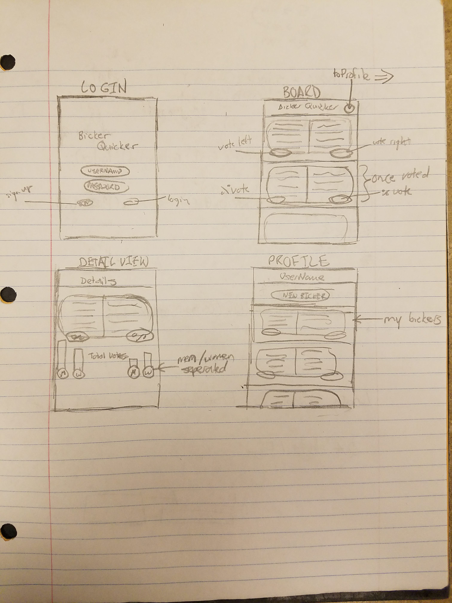

# BickerQuicker
Project Name: **BickerBickerQuicker**

Team : BlizzardLizardz
Team Members : Jon Grider, Brendan Raftery, Harjas Monga, Scott E.

APP DESCRIPTION

The following **required** functionality is completed:

- [ ] User sees app icon in home screen and styled launch screen.
- [ ] User can sign up and sign in to the login screen
- [ ] User can log out of his or her account
- [ ] Use can create and post a Bicker
- [ ] User can view a list of Bickers
- [ ] User can pull to refresh the list of Bickers
- [ ] User can tap on a Bicker to view the full discussion
- [ ] User can vote for one side of a Bicker
- [ ] Auto layout support for iPhone 6 and newer

The following **stretch** features are completed:

- [ ] User can post comments on a Bicker
- [ ] User can log in with their Facebook or Google account
- [ ] User can set a deadline on a Bicker

The following **additional** features are compelted:

- [ ] List additional user stories here

Wireframe:

